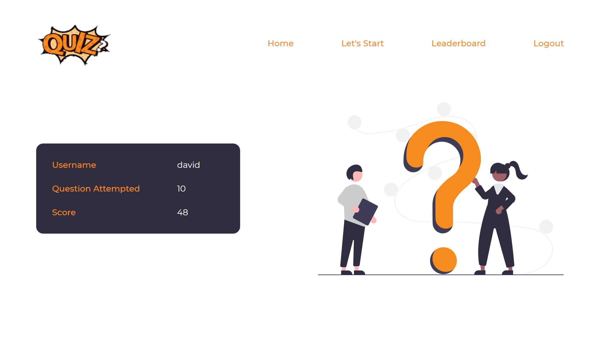
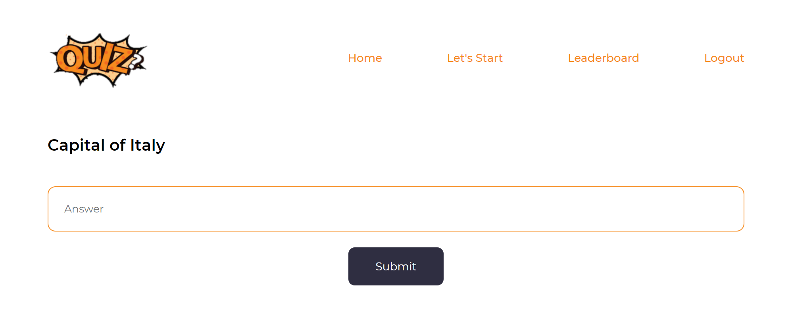

<p align="center">
  <a href="#"></a>
  <h2 align="center">👉 A Quiz App in Django👈</h2>
</p>


<p align="center">


  
 </p>
 
 <p align="center">

  


</p>

## 📌 Introduction

A website where user have to only register for attempting quizzes and can also leaderboard.

## ⭐ How to get started?

You can refer to the following articles on the basics of Git and Github and also contact the Project Mentors, in case you are stuck:

- [Watch this video to get started, if you have no clue about open source](https://youtu.be/SL5KKdmvJ1U)
- [Forking a Repo](https://help.github.com/en/github/getting-started-with-github/fork-a-repo)
- [Cloning a Repo](https://help.github.com/en/desktop/contributing-to-projects/creating-a-pull-request)
- [How to create a Pull Request](https://opensource.com/article/19/7/create-pull-request-github)
- [Getting started with Git and GitHub](https://towardsdatascience.com/getting-started-with-git-and-github-6fcd0f2d4ac6)

## 💥 How to Contribute?

[](http://makeapullrequest.com)
[](https://github.com/ellerbrock/open-source-badges/)

- Take a look at the Existing [Issues]
- Wait for the Issue to be assigned to you after which you can start working on it.
- Fork the Repo and create a Branch for any Issue that you are working upon.
- Read the [Code of Conduct]
- Create a Pull Request which will be promptly reviewed and suggestions would be added to improve it.
- Add Screenshots to help us know what this Script is all about.


## Discord Channel
[](https://discord.gg/pVjcyPtwGx)

## Screenshots



---



## Tech Stack

- **Frontend:** HTML/CSS
- **Backend:** Django

## Quick Start

- Fork and Clone the repo:

```
git clone https://github.com/todi-2000/Quiz-App.git
```

- Create a branch:

```
git checkout -b <branch-name>
```

- Create virtual environment:

```
python -m venv env
env\Scripts\activate
```

- Change Directory:

```
cd quizz
```

- Install dependencies using

```
pip install -r requirements.txt
```

- Make migrations using

```
python manage.py makemigrations
```

- Migrate Database

```
python manage.py migrate
```

- Create a superuser

```
python manage.py createsuperuser
```

- Run server using

```
python manage.py runserver
```

- Push Changes

```
git add .
git commit -m "<your commit message>"
git push --set-upstream origin <branch_name>
```

## Project Admin

|                                                                                                                            <a href="https://github.com/todi-2000"></a>                                                                                                                            |
| :--------------------------------------------------------------------------------------------------------------------------------------------------------------------------------------------------------------------------------------------------------------------------------------------------------------------------------------------------------------------------------------------------------------------------------------------: |
|                                                                                                                                                                                     **[Manshi Todi](https://www.linkedin.com/in/manshi-todi-a017a2178/)**                                                                                                                                                                                      |
| <a href="https://twitter.com/manshitodi"></a> <a href="https://www.linkedin.com/in/manshi-todi-a017a2178/"></a> |

## Like This? Star ⭐ & Fork this Repo.

> Made By Manshi Todi with ❤️
